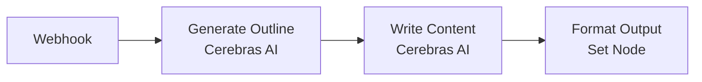

# n8n-nodes-cerebras-api

This is an n8n community node that integrates [Cerebras AI](https://www.cerebras.ai/) inference capabilities into your n8n workflows. Get ultra-fast AI inference using Cerebras' Wafer Scale Engine (WSE) technology with familiar OpenAI-compatible APIs.

**🚀 Features:**
- Lightning-fast inference with Cerebras' WSE technology
- OpenAI-compatible API (seamless migration from OpenAI nodes)
- Support for both chat completions and text completions
- Latest Cerebras models (GPT-OSS-120B, Llama-4, Qwen-3, etc.)
- Advanced parameter controls (temperature, top-p, penalties, streaming)
- Professional Cerebras-style branding and UI
- Comprehensive error handling and validation

## Installation

Follow the [installation guide](https://docs.n8n.io/integrations/community-nodes/installation/) in the n8n community nodes documentation.

### Install from npm

```bash
npm install n8n-nodes-cerebras-api
```

### Install in n8n

1. Go to **Settings** → **Community Nodes** in n8n
2. Click **"Install"**
3. Enter: `n8n-nodes-cerebras-api`
4. Click **"Install"** and wait for completion

## Prerequisites

- n8n version 1.0.0 or higher
- A Cerebras account with API access
- Valid Cerebras API key

## Configuration

### 1. Get Your Cerebras API Key

1. Sign up for a [Cerebras account](https://inference.cerebras.ai/)
2. Generate an API key from your dashboard
3. Keep your API key secure

### 2. Set up Credentials in n8n

1. In n8n, go to **Settings** → **Credentials**
2. Click **"Create New"**
3. Search for "Cerebras API"
4. Enter your API key
5. Test the connection
6. Save the credentials

## Available Models

- **GPT OSS 120B** (`gpt-oss-120b`) - 65,536 max tokens
- **Llama 3.3 70B** (`llama-3.3-70b`) - 65,536 max tokens
- **Llama 4 Maverick 17B** (`llama-4-maverick-17b-128e-instruct`) - 8,192 max tokens
- **Llama 4 Scout 17B** (`llama-4-scout-17b-16e-instruct`) - 8,192 max tokens
- **Llama 3.1 8B** (`llama3.1-8b`) - 8,192 max tokens
- **Qwen 3 235B Instruct** (`qwen-3-235b-a22b-instruct-2507`) - 64,000 max tokens
- **Qwen 3 235B Thinking** (`qwen-3-235b-a22b-thinking-2507`) - 65,536 max tokens
- **Qwen 3 32B** (`qwen-3-32b`) - 65,536 max tokens
- **Qwen 3 Coder 480B** (`qwen-3-coder-480b`) - Large context model

## Usage

### Chat Completion

The most common use case - have conversations with AI:

```json
{
  "operation": "chatCompletion",
  "model": "llama3.1-8b",
  "messages": [
    {
      "role": "system", 
      "content": "You are a helpful AI assistant."
    },
    {
      "role": "user",
      "content": "Explain quantum computing in simple terms."
    }
  ]
}
```

### Text Completion

For prompt-based completions:

```json
{
  "operation": "textCompletion",
  "model": "gpt-oss-120b",
  "prompt": "The future of artificial intelligence is"
}
```

### Advanced Parameters

Fine-tune the AI's behavior:

- **Temperature** (0-2): Controls creativity/randomness (default: 0.7)
- **Max Tokens** (1-65536): Maximum response length (varies by model)
- **Top P** (0-1): Nucleus sampling parameter (default: 1.0)
- **Frequency Penalty** (-2 to 2): Reduce repetition (default: 0)
- **Presence Penalty** (-2 to 2): Encourage topic diversity (default: 0)
- **Stop Sequences**: Custom stop words (comma-separated)
- **Stream Response**: Real-time response streaming (default: false)

## Example Workflows

### Simple Chat Assistant

Create a workflow with:
1. **Manual Trigger** → **Cerebras AI**
2. Configure Cerebras AI node:
   - Operation: Chat Completion
   - Model: llama3.1-8b
   - Message: User input
   - Credentials: Your Cerebras API credentials

### Content Generation Pipeline



### Code Analysis Workflow


## API Response Format

The node returns the complete Cerebras API response, following OpenAI's format:

### Chat Completion Response
```json
{
  "id": "chatcmpl-xxx",
  "object": "chat.completion",
  "created": 1677652288,
  "model": "llama3.1-8b",
  "choices": [
    {
      "index": 0,
      "message": {
        "role": "assistant",
        "content": "The AI response content here..."
      },
      "finish_reason": "stop"
    }
  ],
  "usage": {
    "prompt_tokens": 25,
    "completion_tokens": 150,
    "total_tokens": 175
  }
}
```

### Text Completion Response
```json
{
  "id": "cmpl-xxx",
  "object": "text_completion", 
  "created": 1677652288,
  "model": "gpt-oss-120b",
  "choices": [
    {
      "text": "The completion text here...",
      "index": 0,
      "finish_reason": "stop"
    }
  ],
  "usage": {
    "prompt_tokens": 10,
    "completion_tokens": 90,
    "total_tokens": 100
  }
}
```

## Performance Benefits

Cerebras offers significant advantages over traditional cloud AI APIs:

- **🚀 Up to 16x faster inference** compared to GPU-based solutions
- **⚡ Consistent low latency** with no cold starts
- **📈 High throughput** for batch processing
- **💰 Cost-effective** for high-volume use cases
- **🔄 Reliable performance** with dedicated hardware

## Rate Limits

All models share these rate limits:
- **Requests**: 30/minute, 900/hour, 14,400/day
- **Tokens**: Varies by model (see Available Models section)

## Error Handling

The node provides comprehensive error handling:

- **401 Unauthorized**: Invalid API key
- **429 Rate Limited**: Exceeded rate limits
- **400 Bad Request**: Invalid parameters
- **500 Server Error**: Cerebras API issues

Enable "Continue on Fail" in node settings to handle errors gracefully in workflows.

## Troubleshooting

### Common Issues

1. **Authentication Error**
   - Verify your API key is correct
   - Check that your Cerebras account has API access
   - Ensure credentials are properly saved in n8n

2. **Model Not Found**
   - Use exact model names from the Available Models list
   - Check Cerebras documentation for model availability

3. **Request Timeout** 
   - Try reducing the max_tokens parameter
   - Check your network connection
   - Consider using a smaller model for testing

4. **Rate Limits Exceeded**
   - Implement delays between requests in workflows
   - Monitor your usage in the Cerebras dashboard
   - Consider upgrading your Cerebras plan

### Getting Help

- **Cerebras Documentation**: [inference-docs.cerebras.ai](https://inference-docs.cerebras.ai/)
- **n8n Community Forum**: [community.n8n.io](https://community.n8n.io/)
- **GitHub Issues**: [github.com/kevint-cerebras/n8n-cerebras](https://github.com/kevint-cerebras/n8n-cerebras/issues)

## Development

### Building from Source

```bash
git clone https://github.com/kevint-cerebras/n8n-cerebras.git
cd n8n-cerebras
npm install
npm run build
```

### Testing Locally

```bash
npm link
n8n start
# Node will appear in n8n interface
```

### Contributing

Contributions are welcome! Please:

1. Fork the repository
2. Create a feature branch
3. Make your changes
4. Add tests if applicable  
5. Submit a pull request

## License

[MIT](LICENSE.md) - see LICENSE file for details.

## Changelog

### 0.2.1
- **Fixed**: Package name to comply with n8n requirements (`n8n-nodes-cerebras-api`)
- Updated models to current Cerebras offerings
- Added GPT-OSS-120B, Llama-4, and Qwen-3 models
- Improved Cerebras-style branding and logo
- Enhanced error handling and validation

### 0.2.0  
- Attempted clean package name (discovered n8n naming requirements)
- Professional Cerebras wafer-style logo
- All current Cerebras models supported
- OpenAI SDK integration for reliability

### 0.1.0
- Initial release
- Basic chat completion and text completion support
- Cerebras API integration
- n8n community node structure

---

**Built for the n8n community with ⚡ Cerebras speed**

*Experience lightning-fast AI inference in your n8n workflows!*